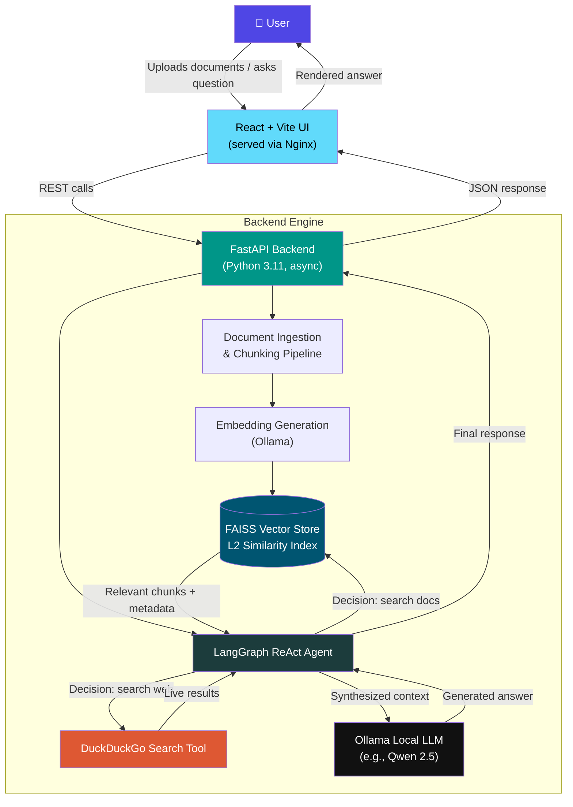
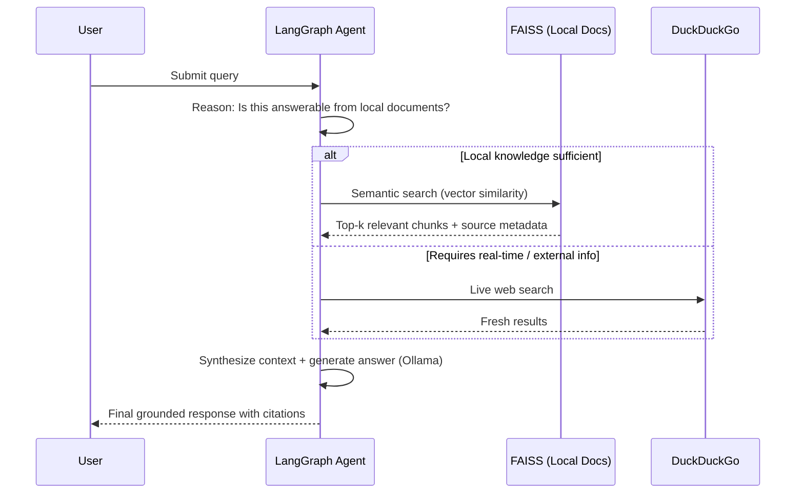

<div align="center">

# 🧠 Multi-Document AI Agent

### 100% Local & Offline Retrieval-Augmented Generation System

*Enterprise-grade, fully decoupled RAG architecture for synthesizing answers across multiple heterogeneous documents — with zero data leakage.*

[](https://www.python.org/)
[](https://fastapi.tiangolo.com/)
[](https://www.langchain.com/langgraph)
[](https://ollama.com/)
[](https://github.com/facebookresearch/faiss)
[](https://react.dev/)
[](https://www.docker.com/)
[](LICENSE)

[Features](#-core-features) • [Architecture](#️-system-architecture) • [Getting Started](#-getting-started-local-development) • [Structure](#-project-structure) • [Roadmap](#-roadmap) • [Maintainer](#-maintainer)

</div>

---

## 📖 Overview

Unlike standard monolithic chat applications or API-dependent wrappers, **Multi-Document AI Agent** is engineered for **absolute privacy and offline capability**. It cleanly separates the user interface from the execution logic, combining an asynchronous Python backend, a localized in-memory vector index, and native tool-calling via local Ollama models — so no document, query, or response ever leaves your machine.

At its core, it's not just RAG — it's **agentic RAG**. A LangGraph-powered ReAct agent autonomously reasons about *how* to answer a question, deciding whether to search your indexed documents, query the live web, or both.

---

## ✨ Core Features

| Feature | Description |
|---|---|
| 🔒 **100% Local Inference** | Powered entirely by local models (e.g., Qwen 2.5) via Ollama — zero data leakage, fully offline. |
| 🤖 **Agentic Tool Calling (LangGraph)** | A ReAct agent graph autonomously decides when to search local documents vs. the live internet (DuckDuckGo), instead of relying on rigid, linear RAG. |
| 📚 **Multi-Document Synthesis** | Upload, index, and query multiple documents simultaneously with strict metadata tracking to prevent context hallucination and source bleed. |
| 🧩 **Decoupled Architecture** | A responsive React/Vite frontend served via Nginx, communicating with an independent, asynchronous FastAPI backend engine. |
| 🔍 **Semantic Vector Search** | Uses FAISS for localized, highly efficient L2-distance document chunk matching. |
| 🐳 **Production Containerization** | Optimized multi-stage Docker builds (Alpine + slim base images) for identical runtime environments locally and in the cloud. |
| ☁️ **Cloud-Ready CI/CD** | Automated GitHub Actions pipeline that builds, tests, and pushes production-ready images to AWS ECR. |

---

## 🏗️ System Architecture

### High-Level Component Map

| Component | Technology | Purpose |
|---|---|---|
| **Frontend** | React, Vite, Nginx | Seamless, non-blocking UI with stateful chat memory |
| **Backend API** | FastAPI, Python 3.11 | Asynchronous document chunking, API routing, AI orchestration |
| **Agent Engine** | LangGraph & Ollama | Autonomous decision routing (ReAct) and local token generation |
| **Vector DB** | FAISS | Stores document embeddings for rapid semantic retrieval |
| **Infrastructure** | Docker Compose | Orchestrates network bridges between decoupled microservices |

### Request Flow Diagram



### Agent Decision Logic (ReAct Loop)



---

## 🚀 Getting Started (Local Development)

### Prerequisites

- 🐳 [Docker](https://www.docker.com/) and Docker Compose installed
- 🦙 [Ollama](https://ollama.com/) installed on your host machine, with your preferred models pulled:

```bash
ollama pull qwen2.5:3b
```

### Installation Steps

**1. Clone the repository**

```bash
git clone https://github.com/YOUR_USERNAME/multidocument-chatbot.git
cd multidocument-chatbot
```

**2. Deploy the full stack via Docker**

```bash
docker compose up --build
```

> **Note:** `docker-compose.yml` is pre-configured to route host-level Ollama traffic securely into the containerized backend.

**3. Access the application**

| Service | URL |
|---|---|
| 🖥️ Frontend UI | [http://localhost:3000](http://localhost:3000) |
| 📑 Backend API Docs (Swagger) | [http://localhost:8000/docs](http://localhost:8000/docs) |

---

## 📂 Project Structure

```
📦 multidocument-chatbot
 ┣ 📂 .github
 ┃ ┗ 📂 workflows
 ┃   ┗ 📜 aws-ecr-deploy.yml     # CI/CD Pipeline Configuration
 ┣ 📂 Backend
 ┃ ┣ 📂 app
 ┃ ┃ ┣ 📂 Graph                  # LangGraph ReAct Logic & Tools
 ┃ ┃ ┣ 📜 main.py                # FastAPI Entrypoint
 ┃ ┃ ┗ 📜 ...
 ┃ ┣ 📜 Dockerfile               # Python 3.11-slim Build
 ┃ ┗ 📜 requirements.txt
 ┣ 📂 frontend
 ┃ ┣ 📂 src                      # React UI Components
 ┃ ┣ 📜 Dockerfile               # Node 20-slim + Nginx Multi-stage Build
 ┃ ┗ 📜 package.json
 ┣ 📜 .gitignore
 ┗ 📜 docker-compose.yml         # Orchestration Config
```

---

## 🧪 Tech Stack Summary

<div align="center">

| Layer | Stack |
|---|---|
| **UI** | React · Vite · Nginx |
| **API** | FastAPI · Python 3.11 · Async I/O |
| **Orchestration** | LangGraph (ReAct Agent) |
| **LLM Runtime** | Ollama (Qwen 2.5 and other local models) |
| **Retrieval** | FAISS (L2 vector similarity) |
| **External Tooling** | DuckDuckGo Search |
| **DevOps** | Docker Compose · GitHub Actions · AWS ECR |

</div>

---

## 🗺️ Roadmap

- [ ] Support for additional local embedding models
- [ ] Persistent vector store (disk-backed FAISS / SQLite hybrid)
- [ ] Multi-agent collaboration for cross-document reasoning
- [ ] Role-based access control for enterprise deployments
- [ ] Streaming token responses in the UI

---

## 🤝 Contributing

Contributions, issues, and feature requests are welcome! Feel free to check the [issues page](../../issues) or open a pull request.

---

## 📜 License

This project is licensed under the **MIT License** — see the [LICENSE](LICENSE) file for details.

---

## 👨‍💻 Maintainer

**Allyan Nawab Khan**
*AI Engineer @ Skytech Developers | Software Engineering Student @ UET Mardan*

Passionate about deploying scalable agentic RAG architectures and multi-agent systems for real-world enterprise operations.

[](https://github.com/YOUR_USERNAME)

---

<div align="center">

⭐ **If you find this project useful, consider giving it a star!** ⭐

</div>
